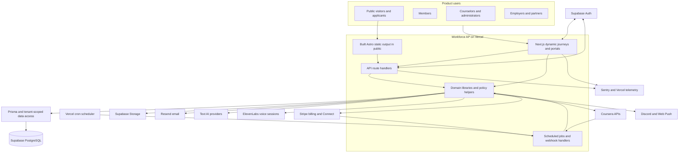
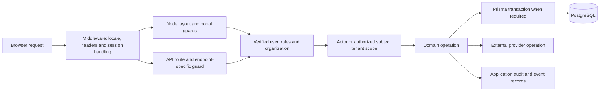
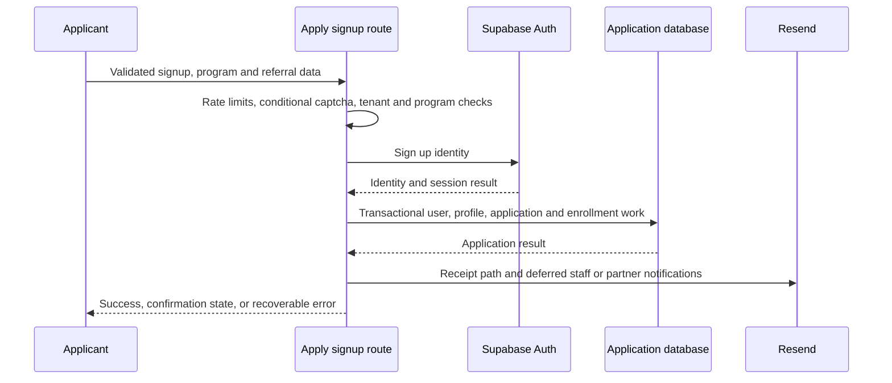
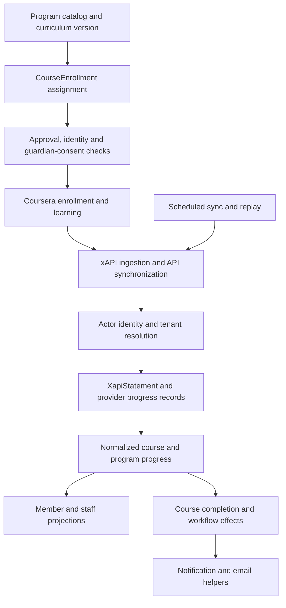
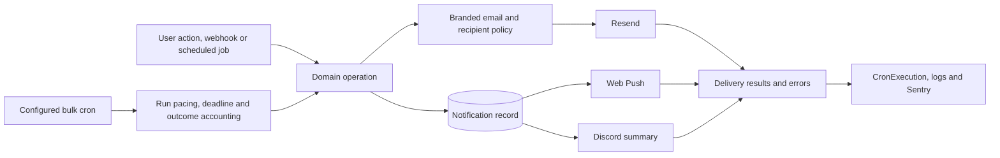
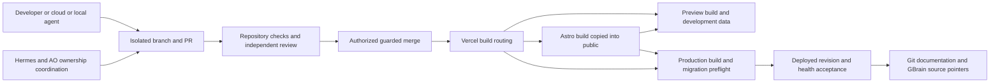

# Architecture

This is a source-backed map of the current application and its delivery context. The [baseline](audit-baseline.json) records the reviewed revision. Provider configuration and live deployment observations need their own receipts. The diagrams summarize relationships; [generated imports](generated/imports.json) and [the complete file catalog](generated/README.md) provide the detailed navigation.

## System context

Anchors: [root layout](../../app/layout.tsx), [Astro routing/build configuration](../../marketing/astro.config.mjs), [API handlers](generated/routes.md), [database client](../../lib/db/prisma.ts), [provider map](integrations.md), [scheduled jobs](generated/crons.md), [instrumentation](../../instrumentation.ts). An API or provider shown here is an implemented integration, not a guarantee that its credentials or every feature are enabled in a given environment.

The codebase combines static Astro marketing output with dynamic Next routes. Locale-prefixed URLs are rewritten internally by [middleware](../../middleware.ts); there is no `app/[locale]` directory. The older i18n design document still names former Next public-page locations, so use the current route catalog and source when locating a public URL. Static assets do not traverse the Next root layout in the same way as server-rendered application pages.

## Request and authorization boundaries

Read [middleware.ts](../../middleware.ts), [authentication](../../lib/auth/server.ts), [roles](../../lib/auth/roles.ts), [portal guards](../../lib/auth/portalGuards.ts), [tenant proxy](../../lib/tenant/withTenantScope.ts), [organization resolution](../../lib/tenant/organization.ts), and [request GUC helpers](../../lib/db/withRequestGuc.ts).

The application has several independent controls. A verified Supabase session identifies the caller. Application roles decide permitted actions. Actor/subject organization checks constrain the data. GUC context transports database identity where enabled. These controls are not interchangeable: the current Prisma client disables the GUC layer unless `WAP_RLS_GUC_ENABLED=true`, and its comments describe a staged RLS rollout. Static source cannot establish the live database role, `FORCE ROW LEVEL SECURITY`, or deployed flag values. See [data and trust boundaries](data.md).

[Auth read recovery](../../lib/auth/authRead.ts) classifies stale sessions separately from transient transport/provider errors. Edge middleware and server auth reads allow one additional read after a 300 ms delay for a transient failure; stale or unexpected failures are not retried by this helper. Protected middleware paths still verify with `getUser`; public `getSession` use is refresh plumbing, not authorization. Only a classified stale session triggers targeted Supabase session-cookie cleanup, including chunks. Transient failures preserve cookies, and auth reads preserve PKCE cookies. Redirects and API denials retain accumulated refresh/clear cookies and request correlation headers. This additional retry budget is not a total request deadline: the Auth SDK can retry refresh internally and underlying request latency remains separate. See [auth recovery regressions](../../tests/api/auth-read-recovery.spec.ts).

[API GUC wrappers](../../lib/db/withRequestGuc.ts) also provide a shared error boundary through [request-scoped reporting](../../lib/observability/apiErrorScope.ts). Uncaught failures return a generic 500 after preserving Next control-flow exceptions; otherwise unreported returned 5xx responses are captured without consuming their body or stream. A detailed error already reported within the request suppresses a duplicate synthetic response error. Telemetry failure must not replace the API result. This boundary supplies observability, not endpoint authorization.

## Application and enrollment flow

The actual branches are in [apply signup](../../app/api/apply/signup/route.ts). The identity service and application database are separate systems: a database failure after signup is not automatically a rolled-back Supabase account. Follow the route's explicit recovery behavior. Program choices come from the code catalog and curriculum logic, while tenant catalogs and enrollment rows control assignment/visibility. Guardian consent is a separate tokenized route and a prerequisite for relevant minor training activation; recovery work is tracked in [technical debt](technical-debt.md), with its detailed reproducer retained privately.

Application review (approve, deny, request info) and WIOA intake verification go through [the status route](../../app/api/admin/members/[id]/status/route.ts), [bulk review](../../app/api/admin/applications/bulk-review/route.ts) and [WIOA review](../../app/api/admin/members/[id]/wioa-review/route.ts). Since 2026-09-19 those routes admit org-scoped admins and active counselors; a counselor may act only on members they are actively assigned to, per [the review access helper](../../lib/counselor/applicationReviewAccess.ts), and records intake verification, never an eligibility determination, which belongs to the workforce board. The counselor student page exposes both controls through `components/counselor/CounselorIntakeReviewPanel.tsx`.

## Training and progress flow

Anchors: [curriculum assignment](../../lib/member/curriculumAssignment.ts), [Coursera libraries](../../lib/coursera), [xAPI pipeline](../../lib/xapi/inboundStatementPipeline.ts), [course completion](../../lib/member/courseCompletion.ts), and [Coursera enrollment flow](../COURSERA-ENROLLMENT-FLOW.md). API polling, xAPI delivery and replay are different entry paths into shared progress logic. Inspect delegated helpers when changing a cron; counting route-local email calls misses downstream sends.

## What is redundant, breaking, or due for replacement

This is the current training/enrollment architecture, not a wish list. Collecting omitted tests (KB-06) does not collapse these layers. Restricted hot-path findings remain in the private bundle.

### Redundant (two or more live sources for one concept)

| Concept | Live sources | What actually wins today |
| --- | --- | --- |
| Member's assigned program | `CourseEnrollment` (`isPrimary`) **and** `User.enrolledProgram` / `User.enrolledAt` | Schema already labels the user columns a temporary pointer. Dashboard state prefers the active/primary enrollment, then still returns it in a field named `enrolledProgram`. Weekly recap, partner attention, skill-mission fallbacks and several admin projections still read the user column. xAPI already prefers primary enrollment and only accepts the user column when a row mirrors it ([resolveInboundProgramSlug](../../lib/xapi/resolveInboundProgram.ts)). |
| Enrollment write | One writer: [upsertEquivalentCourseEnrollment](../../lib/member/courseEnrollmentAssignment.ts) (WAP-174, 2026-09-20) | Apply, invite-accept, member enroll, admin program change, bulk-update, program-change-request, admin member-create, Coursera reconcile add-to-WAP and B4B sync all go through the helper, which accepts a transaction or tenant-scoped client and reports `assignmentOutcome`. A path-allowlist test ([curriculumAssignmentWriters](../../lib/member/curriculumAssignmentWriters.test.ts)) and an ESLint `no-restricted-syntax` ban reject `courseEnrollment.create`/`upsert` anywhere else. B4B still pins `User.enrolledProgram` separately and **refuses to overwrite a non-null mismatch**, so the two stores can diverge on purpose. |
| Program definition | [App catalog](../../lib/content/programs.ts) (comments still call it the single source of truth), [marketing catalog](../../marketing/src/data/programs.ts) (TWC price list), [tenant `OrganizationProgramCatalog`](../../lib/platform/programCatalog.ts), Prisma `Course` rows, curriculum manifests | Assignment and dashboard use the app catalog + stored `curriculumVersion`. Public hours/price lists use marketing. Tenant rows gate which slugs are enrollable. Course lists at runtime try B4B, then `Course` rows, then static `program.courses`. These are not the same object. |
| Public URL | Astro output copied into `public/` **and** Next journeys + middleware | Owner is per URL, not per framework. |
| Portal UI | `--wa-*` kit **and** Astryx overlays **and** leftover `--color-*` aliases | New kit work uses `--wa-*`. New overlays use Astryx. Mixing them inside kit components is a defect, not coexistence. The brand hues are global ([wa-brand-tokens.css](../../css/wa-brand-tokens.css), loaded by the root layout) so the Astryx bridge computes the same values on public routes; neutrals and `color-scheme` stay in [portal-tokens.css](../../css/portal-tokens.css). Admin surfaces no longer read `--color-blue/green/gold` ([guard test](../../lib/ui/adminSemanticTokens.test.ts)). |
| Email send | [lib/email.ts](../../lib/email.ts) templates **and** [lib/email/send.ts](../../lib/email/send.ts) transport | Templates wrap transport. Counting one file's call sites misses the other. |

### Breaking (failure paths that exist in source today)

- **Dual program pointer.** A primary `CourseEnrollment` and a non-null `User.enrolledProgram` can name different programs. Recap and some staff queues follow the user column; training and xAPI follow enrollment. That is a live split, not a naming quirk.
- **Bypass writers.** Admin create and reconcile `create` skip alias consolidation and the helper's "existing progress stays on legacy curriculum" rule. A second insert for an equivalent slug hits `@@unique([userId, programSlug])` instead of updating the existing row.
- **Two catalogs already disagree.** [programCatalogParity.test.ts](../../lib/content/programCatalogParity.test.ts) skips eight shared slugs, including Security+ (marketing 40 hours / 4 courses vs app 30 hours / 3). The skipped tests make CI green while TWC hours and member denominators differ.
- **Auth and application DB are not one transaction.** Signup can leave a Supabase identity without matching Prisma rows. Recovery is route-specific.
- **GUC/RLS is not on unless enabled.** `withApiGuc` / `withTenantScope` in a route is not proof the database will refuse a cross-tenant write.
- **Restricted recovery/authz defects** (billing state, privileged-account admin, tenant response/candidate scope, guardian-consent token spend, transaction flattening) stay in KB-AUDIT-20260912. Do not re-derive them from this map.

### Replacement order (do not skip steps)

1. **One enrollment writer.** Route remaining `courseEnrollment.create` / copied alias lookups through `upsertEquivalentCourseEnrollment`. Keep curriculumVersion immutable on retry.
2. **One read resolver.** Every product path that needs "the member's program" calls the same helper: primary `CourseEnrollment`, else mirrored legacy pointer, else none. Stop adding new `User.enrolledProgram` reads. Member `/dashboard/program` and `/dashboard/program/start` both go through [getActiveProgramForDashboard](../../lib/member/getActiveProgramForDashboard.ts); start must not bounce on a null leftover `User.enrolledProgram` when a primary `CourseEnrollment` exists.
3. **Demote the user columns to a derived projection.** Writers may keep filling them until recap, partner queues and leftover admin views migrate. Then drop the columns.
4. **One public catalog for hours/titles.** Reconcile marketing vs app (remove `KNOWN_HOUR_DRIFT` by making one list authoritative) before treating either as TWC-accurate.
5. **Do not promote Prisma `Course` or B4B live lists to assignment authority** until curriculumVersion and the app catalog agree. Live Coursera contents are evidence, not the enrollment contract.
6. **Leave Astro/Next and kit/Astryx as coexistence, not merge projects**, unless a specific overlapping URL or surface is being migrated with an owner.

KB-06 made omitted Node suites visible. It did not replace these sources of truth. WAP-14 notification reliability is a separate owner and is not this replacement list.

## Staff reporting projections

The [counselor roster loader](../../lib/admin/counselorRoster.ts) searches and paginates active counselors in the database, with 50 rows per page and stable name/ID ordering. Whole-cohort counters remain separate from the filtered page. [Assignment aggregates](../../lib/admin/counselorRosterAggregates.ts) count active assignments to active counselors with counselor/member tenant predicates; the explicit super-admin scope remains supported. Caseload counts assignment rows, placements count those whose member status is `placed`, and the roster's risk count retains its inactive/no-login/over-21-day-login predicate. This roster measure is distinct from persisted risk-alert queues. Response time is unmeasured and displays as unknown. Load failure renders a recoverable error panel, with retry or legacy navigation as an explicit choice, rather than a successful-looking empty roster.

[Member-detail outcomes](../../lib/admin/memberOutcomesSummary.ts) use four scoped aggregates instead of hydrating a full board report. The preserved historical denominator is non-deleted users with a non-null legacy `enrolledProgram`; the numerator counts placement records, not distinct members. The recent count covers the preceding 90 days through the supplied current time. Mean weeks uses records with a positive interval from legacy enrollment to placement and remains unknown when none qualify. These are existing operational definitions, not a reconciled funder cohort or proof that legacy enrollment pointers are complete. See [reporting regressions](../../tests/lib/staff-reporting-efficiency.spec.ts) and [roster failure handling](../../tests/app/counselor-roster-failure.spec.tsx).

## Communication and asynchronous work

The diagram separates persistence, provider acceptance, and user-visible receipt. The reviewed WAP-14 policy suppresses fixture recipients across the complete envelope; records those outcomes as skipped; shares one bounded pacer and absolute deadline across bulk routes and delegated helpers; and retains request-lifetime work only through an awaited promise or synchronous Next `after()` registration. In-app rows are app-inbox state, Resend/Discord/Web Push responses are channel acceptance, and none proves inbox or screen display. Placement-survey `sentAt = null` is pre-acceptance workflow state, excluded from sent readers/counters and represented as null in member exports; each attempt persists the complete helper-level provider payload (recipient, template inputs, signed URL, wave, and row/attempt key) before egress; ambiguous retries resolve that persisted attempt before consulting current contact data, reuse it exactly even if member fields change or email is removed, and account the frozen recipient as sent, while a later intentional resend advances the persisted attempt and freezes a new payload. [Notification creation](../../lib/notifications/create.ts), [email transport](../../lib/email/send.ts), [email helpers](../../lib/email.ts), [Discord](../../lib/notify/discord.ts), [pacing](../../lib/email/pacing.ts), and [the job catalog](generated/crons.md) are the implementation anchors.

## Delivery and developer orchestration

Anchors: [workflows](../../.github/workflows), [Vercel configuration](../../vercel.json), [build router](../../scripts/vercel-build.cjs), [deployment checklist](../DEPLOYMENT-CHECKLIST.md), [operating lanes](../two-lanes.md). The router first validates `VERCEL_ENV` and selects the build command, then compiles Astro, copies its output into `public/`, and runs the selected Next build; the [operations diagram](operations.md#build-routing) shows the exact sequence. Astro's presence in the build does not establish which overlapping URL serves which implementation. AO, Hermes, Cursor, OpenClaw and the homelab are development/control-plane context. They are not the Vercel application's web-serving tier. A website deploy also does not apply an ElevenLabs agent patch.

## Complete machine diagrams

- [All declared Prisma relationships, Mermaid source](generated/database-relations.mmd): every model and relation field, including inverse relationships.
- [All indexed area-to-area static import relationships, Mermaid source](generated/area-dependencies.mmd).
- [Prisma fields, enums and source locations](generated/models.json), [every import reference](generated/imports.json), and [all route/layout files](generated/routes.json).

These exhaustive diagrams are supplied as separate artifacts because the full database and dependency network is too dense for the orientation view. Relation declarations do not enumerate migration-only SQL policies/triggers; static import edges do not capture runtime callbacks, HTTP calls or computed imports.
