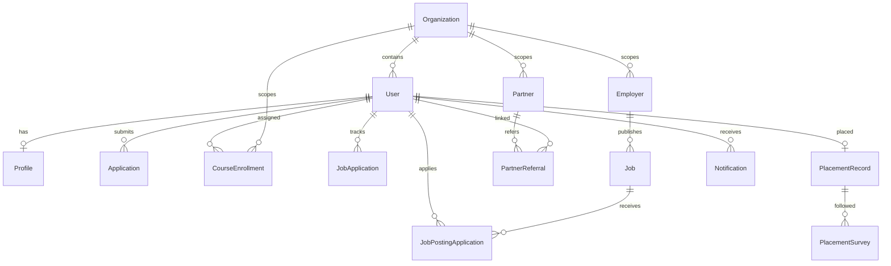

# Data model and ownership

The [complete schema catalog](generated/models.md) and [field/relationship JSON](generated/models.json) cover every declared Prisma model and enum. The schema is only one layer: migration SQL contains policies, indexes and triggers that `db:push` does not reproduce, while actual deployed state requires an environment-specific inspection.

## Core entity map

This overview shows selected declared relationships. Use the [complete Mermaid relationship artifact](generated/database-relations.mmd) for all models and inverse fields. Application policy may be stricter than the schema's optional/cardinality declarations.

## Names that are easy to confuse

| Concept | Actual source or records | What to check before changing it |
| --- | --- | --- |
| Identity vs application user | Supabase Auth identity; Prisma `User`, `Profile`, `Role`, `UserRole` | A provider identity and domain rows can be temporarily inconsistent. Follow provisioning/recovery and soft-deletion checks in [auth](../../lib/auth/server.ts) and [ensureAppUser](../../lib/member/ensureAppUser.ts). |
| Organization vs partner/employer | `Organization` is the tenant; `Partner` and `Employer` belong to it | A partner/employer identifier is not a substitute for verified actor organization. |
| Admissions application | `Application`, eligibility/screening models | This is entry into Workforce AP; it is not a job application. |
| Personal job tracker | `JobApplication` | Member-entered company/role/status, optionally linked to a curated job. |
| Application to a posted job | `JobPostingApplication`, `ApplicationMessage` | Employer-facing application and conversation; scope both sides of the relationship. |
| Job catalogs and matches | `Job`, `WapJob`, `SavedJob`, `AIJobMatch` | Do not assume similarly named catalogs or cached AI matches share the same visibility rules. |
| Program definitions | [code program catalog](../../lib/content/programs.ts), tenant/partner program-catalog rows | There is no Prisma `Program` model at this baseline. Definitions and allowed assignment/visibility are separate. |
| Enrollment and curriculum version | `CourseEnrollment`; [curriculum assignment](../../lib/member/curriculumAssignment.ts) | Preserve organization, program slug, curriculum version, primary selection, funding and provenance. `User.enrolledProgram` is a redundant pointer, not the assignment model; some recap/staff paths still read it, and B4B sync will not overwrite a mismatch. See [replacement order](architecture.md#what-is-redundant-breaking-or-due-for-replacement). |
| Training evidence vs projection | `XapiStatement`, Coursera mapping/progress records, `CourseProgress`, `MemberProgramProgress` | Inbound evidence, identity resolution and displayed normalized progress are different stages. Replay must preserve idempotency and delivery accounting. The member dashboard home reads these live tables (plus `MemberPoints` / `UserCertification`), not the legacy `User.coursesCompleted` JSON. `prisma/seed-demo.ts` now writes both. |
| Study work and labs | `TrainingStudyPlan`, `TrainingCourseWork`, `MemberLabDraft`, `MemberLabSubmission`, `MemberLabReview` | Distinguish learner work, submission and staff review; inspect authorization and storage references. |
| Placement vs outcome reporting | `PlacementRecord`, `PlacedOutcome`, `PlacementSurvey` | Follow [outcomes methodology](../OUTCOMES-METHODOLOGY.md) and verified-start/retention rules before payouts or reporting. |
| Provider billing vs stored status | Stripe objects; `Organization`, `Employer`, `EmployerSubscription` fields | Signed webhook delivery updates local projections. Confirm the provider/local-state reconciliation contract before changing billing behavior. |
| Audits and workflow logs | `AuditLog`, `AuditEvent`, `MemberEvent`, `WebhookEvent`, `CronExecution`, `WorkflowDiagnostic` | These record different events and audiences. They are not interchangeable audit trails or proof that an external effect completed. |
| AI output and conversation memory | `AIToolResult`, `CoachMemory`, `ApplicationAiFeedback` | Application/member data stays within its authorized product context. GBrain's developer KB is a source-navigation layer, not a mirror of this content. |

Orphan recovery uses the verified Auth ID. Tenant hints come from the resolved
request or server-controlled Auth `app_metadata`, never user-editable
`user_metadata`. If an existing non-member app user lacks a profile, recovery
restores that role from stored role rows or portal associations without adding
the baseline member role. An Auth identity with no app row still falls back to
member provisioning; its intended role cannot be established from Auth identity
alone and needs a separate enrollment/recovery decision.

## Trust and transaction boundaries

Read [tenant scope](../../lib/tenant/withTenantScope.ts), [organization helpers](../../lib/tenant/organization.ts), [request organization resolution](../../lib/tenant/resolveOrgFromRequest.ts), [Prisma](../../lib/db/prisma.ts), and [request GUC context](../../lib/db/withRequestGuc.ts).

- Resolve the actor from a verified session and application account state. Resolve a subject's organization only after authorizing the actor to operate on that subject.
- `crossTenantOK` names an intentional escape hatch; it does not by itself authorize a caller. Review the gate and the returned data.
- GUC context uses `AsyncLocalStorage`; database-local settings and RLS enforcement depend on the configured Prisma path, transaction scope, database role and deployed policies. The normal client returns without installing the GUC layer unless explicitly enabled. Do not infer database-enforced tenant isolation from the presence of `withApiGuc` in a route.
- The preview transaction-flattening path replaces transactions with ordinary operations. `lib/db/transactionPolicy.ts` is the source contract for this mode: preview/development may flatten for non-atomic callers, atomic guardian-consent writes refuse that mode, and an explicit production flatten flag fails during Prisma initialization. Deployed flags were not inspected, and no live data-loss claim is made.
- A Supabase Auth operation, a Prisma transaction, a Stripe request and an email send do not share one atomic transaction. Changes that cross these boundaries need idempotency, reconciliation and a durable outcome appropriate to the feature.

## Recovery and schema changes

[Database recovery](../DATABASE-RECOVERY.md) is the governing runbook. Clean historical migration replay is not currently supported. `db:push` is for disposable development fixtures and omits migration-only security DDL. Do not rewrite old migration checksums or infer restore readiness from a successful application build.

Before a schema-dependent release, confirm the intended environment, existing migration state, backup/recovery evidence, release owner and applicable deployment preflight. The [operations guide](operations.md) describes the build and release paths; this static model index does not certify either database's current schema.
