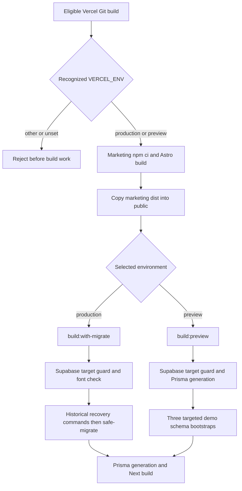

# Operations

This reference describes the checked-in operating paths reviewed on 2026-09-12. It does not establish the current deployed SHA, provider configuration, backup availability, or successful delivery. Start with [AGENTS.md](../../AGENTS.md), the [deployment checklist](../DEPLOYMENT-CHECKLIST.md), and [database recovery](../DATABASE-RECOVERY.md) for release work. Provider entry points are in [integrations](integrations.md).

## Enter by task

| Task | Start here |
| --- | --- |
| Run a local checkout | [Install and development](#install-and-development) |
| Diagnose a failing PR | [Checks and CI](#checks-and-ci), [CI workflow](../../.github/workflows/ci-gate.yml#L35) |
| Prepare a preview or production release | [Build routing](#build-routing), [Supabase scoping](../STAGING_ENV.md) |
| Investigate migration or rollback trouble | [Database and rollback](#database-and-rollback) |
| Investigate missed scheduled work | [Scheduled work](#scheduled-work), [cron registry](../../lib/admin/cronRegistry.ts) |
| Investigate a healthy probe alongside broken pages | [Health and observability](#health-and-observability) |
| Hand work between cloud and local agents | [Execution ownership](#provisioning-names-and-execution-ownership) |

## Install and development

The root is a Next.js application; `marketing/` is a separate Astro package whose output is included in the Vercel build. Root [package.json](../../package.json#L5) selects `pnpm@10.34.3`; [CI uses Node 22](../../.github/workflows/ci-gate.yml#L71). The root has no `engines` declaration. Use the CI major and the selected package manager when reproducing a failure. Marketing uses its own [package-lock.json](../../marketing/package-lock.json), React 18 and Astro; the root uses [pnpm-lock.yaml](../../pnpm-lock.yaml), React 19 and Next. A root install does not install marketing dependencies.

```bash
# From the repository root; installs run the Prisma generation postinstall.
corepack pnpm@10.34.3 install --frozen-lockfile
npm --prefix marketing ci --no-audit --no-fund
npm run dev
```

`npm run dev` starts Next on the usual local port. `npm --prefix marketing run dev` starts the separate Astro development surface. For a complete build fixture, follow the [marketing build/copy steps](../DEPLOYMENT-CHECKLIST.md#pre-deploy-local); generated `marketing/dist` and staged `public` output are not source changes to commit. [copyMarketingBuild](../../scripts/vercel-build.cjs#L28) overlays the Astro output into `public`.

The shared [Prisma environment wrapper](../../scripts/ensure-prisma-env.cjs#L8) reads `.env`, falls back from `DATABASE_URL` to the two Prisma connection names, and supplies placeholders when no database is configured. Next reads its normal environment files, including `.env.local`. Provision these through the approved secret channel; keep the intended target consistent between commands and the server. No values belong in this reference.

Generation/build success with placeholder URLs does not prove runtime database access. [The root layout](../../app/layout.tsx) resolves the default organization through [organization.ts](../../lib/tenant/organization.ts), so rendering Next pages requires reachable Postgres and the seeded default organization. Root [AGENTS.md](../../AGENTS.md#environment-notes) documents the Cursor Cloud PostgreSQL service and disposable fixture setup. Use `db:push` and `db:seed` only for disposable development fixtures under that procedure: they are not a complete recreation of migration-only RLS, functions or triggers. Do not substitute production when the demo or local fixture is unavailable.

## Checks and CI

The commands are defined in [package.json](../../package.json#L6); the table distinguishes what they establish.

| Command | Contract |
| --- | --- |
| `npm run typecheck` | TypeScript without emitting application output. |
| `npm run lint` | ESLint; also enforced by [Next build configuration](../../next.config.ts#L55). |
| `npm run check-migrations` | Required early CI guard for new timestamp collisions and exact historical directory/SQL exceptions. The reviewed source commit and complete manifest digest are anchored in checker source; editing the JSON alongside a migration cannot approve it. [Checker](../../scripts/check-duplicate-migrations.mjs), [pinned exceptions](../../scripts/migration-collision-baseline.json) and [recovery limits](../DATABASE-RECOVERY.md#repository-migration-collision-gate). Does not prove SQL safety or clean replay. |
| `npm run test:unit` | Node unit lane for `lib/`, `app/`, `emails/`, `shared/` and `scripts/` node:test suites. [test-unit.mjs](../../scripts/test-unit.mjs) stubs `server-only` and logs explicit Vitest and real-DB delegations/skips. `npm test` runs only this lane. |
| `npm run test:vitest` | Component/API suites and registered library suites. [vitest.config.ts](../../vitest.config.ts#L9) and [the shared registry](../../scripts/vitest-library-specs.mjs) determine collection; [coverage ownership tests](../../tests/test-runner-coverage.test.ts) protect it. Run both lanes. |
| `npm run test:e2e` | Playwright journeys; requires the appropriate running application, fixtures and credentials. Review [playwright.config.ts](../../playwright.config.ts) before choosing a target. |
| `npm run build:local` | Font check, Prisma generation and Next compilation. Does not apply migrations or automatically build marketing. |
| `npm run build` | Adds the Supabase target guard to the normal Next build. Does not run production migrations. |
| `node scripts/verify-pdf-deployment.mjs` | After a fresh build, checks the dynamic PDF assets in emitted route traces; source-only parser tests cannot establish serverless packaging. |
| `npm run check:source-text-tests` | Required CI guard (WAP-175). Fails when a test file outside [the frozen baseline](../../scripts/source-text-tests-baseline.json) reads application source (`app/`, `lib/`, `components/`, `emails/`, `css/`, `prisma/`) with a file read; such a test proves a string exists, not that the feature works. The baseline may only shrink (`--update-baseline`). Reading `tests/fixtures/**` or `messages/**` is not flagged. [Guard](../../scripts/verify-no-source-text-tests.mjs). |
| `npm run test:db-contract` | Database contract lane (WAP-175). Against a **local** disposable PostgreSQL only: `prisma db push` of the current `schema.prisma` (clean migration replay is unsupported, so the schema file is the executable baseline until WAP-178 lands a replayable chain), then [isolated migration proofs](../../tests/migrations), [RLS proofs](../../tests/rls) when `RLS_PROOF_DATABASE_URL` is set, and the real-database node:test suites with `TEST_REAL_DB=1` (`--only` restricts the runner to named files). `db push` omits migration-only RLS/trigger DDL; the RLS proof covers the member-message policies from the captured migration. [Runner](../../scripts/run-db-contract-tests.mjs). |

[Required CI](../../.github/workflows/ci-gate.yml#L3) runs on PRs, merge-queue commits (`merge_group`, WAP-201) and pushes to `master`, plus manual dispatch. A newer push to the same PR cancels the older run; each push to `master` runs to completion. Since WAP-200 the gate is four parallel jobs: `static-gates` (after install and Prisma generation, [scripts/prepush.mjs](../../scripts/prepush.mjs) `--ci` runs migration timestamp history, the source-text test guard, admin mutation audit, high-risk tenant routes, the tenant-scoping ratchet, font verification, typecheck, every part of `npm run lint` and knip; agents run the same script locally as `npm run prepush`, WAP-203), `unit` (Node tests), `vitest` (two `--shard` jobs that together run every Vitest file) and `build` (marketing `npm ci`/build/copy, Prisma generation, Next build with a restored `.next/cache`, and PDF deployment verification). The `ci` job, still named **Typecheck & Build**, needs all four and fails unless every one succeeded, so that check name keeps meaning "every gate passed". Knip is a required gate (WAP-37). A separate `database-contract` job stands up a PostgreSQL 16 service and runs `scripts/run-db-contract-tests.mjs` (schema push, migration proofs, the member-message RLS proof and the real-database role tests), uploading the RLS proof artifact. CI uses declared dummy configuration and does not establish real provider access or production migration readiness; the pushed schema is not a replay of `prisma/migrations`.

Additional workflows have separate meanings:

- [Locked Product Stakes](../../.github/workflows/locked-product-stakes.yml#L38) checks specific protected product files for approval or the conservative i18n bypass.
- [Coursera Catalog Placeholders](../../.github/workflows/coursera-catalog-placeholders.yml) enforces its source-script baseline; it is not a live catalog check.
- [Authenticated Portal Smoke](../../.github/workflows/authenticated-portal-smoke.yml#L24) is manual, restricted to trusted `master`, checks deployed version against its checkout, and separates five-role isolated-preview coverage from non-staff production canaries. Target and role credentials are workflow secrets; inspect its mode before invocation.
- [FORCE RLS Shadow Rehearsal](../../.github/workflows/force-rls-shadow.yml#L21) is manual and report-only against a disposable PostgreSQL service. Its existence does not prove production RLS correctness.
- [deploy.yml](../../.github/workflows/deploy.yml#L1) is a disabled historical self-hosted deployment workflow.

## Build routing

[vercel.json](../../vercel.json#L2) delegates to `npm run build:vercel`. Its ignored-build expression allows production and preview branch names matching `feature/portal-*`, `feature/astro-*`, `claude/*`, or `codex/*`; other non-production refs are skipped by that expression. Verify actual project settings when releasing: this file alone does not prove a deployment ran.



The routing authority is [vercel-build.cjs](../../scripts/vercel-build.cjs#L7) plus [package scripts](../../package.json#L8), not a generic `npm run build` assumption. The orchestrator's `--check` only checks environment routing; it does not validate a build.

Production selects `build:with-migrate`: two named historical rollback-resolution commands, [safe-migrate](../../scripts/safe-migrate.cjs#L138), generation and compilation. Preview selects three narrow bootstraps: [approved curriculum](../../scripts/apply-preview-approved-curriculum-schema.cjs), [training workspace](../../scripts/apply-preview-training-workspace-schema.cjs), and [member lab](../../scripts/apply-preview-member-lab-schema.cjs). Each is tied to specific migration SQL and demo-target checks. These are not a general migration mechanism. The older prose in [STAGING_ENV.md](../STAGING_ENV.md#migration-routing) names only the original curriculum bootstrap; use the current package script for the complete list.

## Database and rollback

[The Supabase guard](../../scripts/check-supabase-env.mjs#L23) requires explicit recognized public, pooled and direct URLs on Vercel, plus a usable `NEXT_PUBLIC_SUPABASE_ANON_KEY`; Vercel's CI flag cannot bypass it. [The shared validator](../../scripts/lib/supabase-project-guard.cjs#L111) owns environment-to-project mapping. Preview/development use the demo project; production uses the production project. [Prisma](../../prisma/schema.prisma#L12) uses `POSTGRES_PRISMA_URL` at runtime and `POSTGRES_URL_NON_POOLING` for direct operations. `DATABASE_URL` is a wrapper fallback, not a replacement for Vercel's required explicit names.

The optional command `node scripts/check-supabase-env.mjs --check-pool-contract` inspects the already-configured runtime URL for PostgreSQL protocol, transaction-pooler port `6543`, explicit `connection_limit=1`, a positive integer `pool_timeout`, and `pgbouncer=true`. The [pool inspector](../../scripts/lib/runtime-pool-contract.cjs) returns only those non-secret parameters and validation messages, never the URL, host or credentials. This opt-in check does not change build defaults, environment values or pool settings, and does not prove live connection capacity or performance. Its [synthetic tests](../../scripts/lib/runtime-pool-contract.test.cjs) require no database connection.

Before a release, follow [existing-database preflight](../DATABASE-RECOVERY.md#preflight-for-an-existing-database): identify target and release, inspect migration status and pending SQL against actual objects, confirm backup/restore evidence, and record schema compatibility. Let the configured production build run migration once. Do not run a second migration concurrently.

Clean historical migration replay is **unsupported**. The [2026-09-09 recovery audit](../DATABASE-RECOVERY.md#what-the-recovery-audit-proved) reproduced both a duplicate `partner_users` table and a later foreign-key dependency on not-yet-created `subgroups`. More blockers may exist. Preserve historical filenames, SQL bytes and recorded checksums. Neither appending migrations nor resolving successive failures is a fresh-database recovery plan.

[safe-migrate](../../scripts/safe-migrate.cjs#L141) propagates a failed deployment and does not automatically resolve unknown failures. Its explicit `--force-resolve` skips schema-integrity checks. A `--rolled-back` marker does not undo SQL. The [two recovery runners](../../scripts/resolve-failed-migration.cjs) remain part of the production script for specific historical incidents, not permission to bypass current migration failures.

A failed build can already have changed the database before compilation fails. A Vercel application rollback changes the application artifact, not Postgres. Confirm the old app supports the current schema; otherwise prepare a specific forward repair or reviewed recovery. [Backup observations](../DATABASE-RECOVERY.md#backup-evidence-and-limits) are dated evidence, not proof of current availability, a restore rehearsal, guaranteed recovery time, or PITR. Recheck and rehearse in isolation before choosing a production recovery.

## Scheduled work

[vercel.json](../../vercel.json#L4) is the schedule authority, with 30 declared entries at this review. Expressions below are the checked-in cron expressions (UTC). A route existing in `app/api/cron` does not mean it is scheduled. Provider dashboard state and execution records must be checked separately to establish that jobs ran.

| Scheduled route | Cron expression (UTC) |
| --- | --- |
| [/api/cron/applicant-followup](../../app/api/cron/applicant-followup/route.ts#L1) | `7 11 */3 * *` |
| [/api/cron/at-risk-alerts](../../app/api/cron/at-risk-alerts/route.ts#L1) | `7 13 * * 1` |
| [/api/cron/at-risk-check](../../app/api/cron/at-risk-check/route.ts#L1) | `11 6 * * *` |
| [/api/cron/coursera-auto-heal](../../app/api/cron/coursera-auto-heal/route.ts#L1) | `15 * * * *` |
| [/api/cron/coursera-b4b-sync](../../app/api/cron/coursera-b4b-sync/route.ts#L1) | `30 */6 * * *` |
| [/api/cron/coursera-sync](../../app/api/cron/coursera-sync/route.ts#L1) | `0 */6 * * *` |
| [/api/cron/coursera-training-sync](../../app/api/cron/coursera-training-sync/route.ts#L1) | `5 * * * *` |
| [/api/cron/course-accountability](../../app/api/cron/course-accountability/route.ts#L1) | `13 15 * * *` |
| [/api/cron/data-cleanup](../../app/api/cron/data-cleanup/route.ts#L1) | `30 7 * * *` |
| [/api/cron/deploy-health](../../app/api/cron/deploy-health/route.ts#L1) | `0 * * * *` |
| [/api/cron/inactive-nudge](../../app/api/cron/inactive-nudge/route.ts#L1) | `23 10 * * 1` |
| [/api/cron/inactivity-nudge](../../app/api/cron/inactivity-nudge/route.ts#L1) | `29 10 * * 3` |
| [/api/cron/interview-reminders](../../app/api/cron/interview-reminders/route.ts#L1) | `30 14 * * *` |
| [/api/cron/onboarding-stalls](../../app/api/cron/onboarding-stalls/route.ts#L1) | `30 15 * * 2` |
| [/api/cron/employer-pending-applicants](../../app/api/cron/employer-pending-applicants/route.ts#L1) | `17 16 * * 2` |
| [/api/cron/job-expiry](../../app/api/cron/job-expiry/route.ts#L1) | `45 7 * * *` |
| [/api/cron/retention-decisions](../../app/api/cron/retention-decisions/route.ts#L1) | `30 13 * * 4` |
| [/api/cron/job-alerts](../../app/api/cron/job-alerts/route.ts#L1) | `37 9 * * 1` |
| [/api/cron/milestone-cascade-draft](../../app/api/cron/milestone-cascade-draft/route.ts#L1) | `0 * * * *` |
| [/api/cron/milestone-cascade-expire](../../app/api/cron/milestone-cascade-expire/route.ts#L1) | `0 9 * * *` |
| [/api/cron/milestone-celebration](../../app/api/cron/milestone-celebration/route.ts#L1) | `43 11 * * *` |
| [/api/cron/partner-outcome-digest](../../app/api/cron/partner-outcome-digest/route.ts#L1) | `47 13 * * 1` |
| [/api/cron/placement-survey](../../app/api/cron/placement-survey/route.ts#L1) | `41 14 * * *` |
| [/api/cron/smoke-test](../../app/api/cron/smoke-test/route.ts#L1) | `0 * * * *` |
| [/api/cron/stale-training-check](../../app/api/cron/stale-training-check/route.ts#L1) | `30 12 * * *` |
| [/api/cron/verification](../../app/api/cron/verification/route.ts#L1) | `0 11 * * *` |
| [/api/cron/weekly-recap](../../app/api/cron/weekly-recap/route.ts#L1) | `53 18 * * 0` |
| [/api/cron/weekly-recap-email](../../app/api/cron/weekly-recap-email/route.ts#L1) | `19 22 * * 5` |
| [/api/cron/wioa-report](../../app/api/cron/wioa-report/route.ts#L1) | `31 14 1 * *` |
| [/api/admin/webhooks/process-retries](../../app/api/admin/webhooks/process-retries/route.ts#L1) | `*/10 * * * *` |

Most jobs use [withCronLogging](../../lib/cron/withCronLogging.ts): authorize before the handler, enter system GUC context, create a `CronExecution`, inspect the [durable workflow setting](../../lib/cron/isCronEnabled.ts), then run and record the result. Disabled work records `SKIPPED`; handler responses of 400 or above record `FAILED`. Start, settings, handler and result-persistence failures are reported with their phase, with best-effort failure persistence if an execution exists. Unauthorized calls (WAP-177) are throttled to one trace per wrapper instance, reason and five minutes: that trace is an error report, a `FAILED: unauthorized: <reason>` execution row and an error diagnostic under the system context, so a missing or rotated secret is visible on `/admin/crons` instead of silent. The wrapper module also asserts at load that `CRON_SECRET` is set when `NODE_ENV=production` (never during `next build`); previews opt out with `CRON_ALLOW_MISSING_SECRET=1` ([policy](../../lib/cron/cronSecretPolicy.ts)). Set `UNSUBSCRIBE_TOKEN_SECRET` before rotating `CRON_SECRET`: unsubscribe links fall back to it and would all invalidate. Every scheduled route and the retry processor export `maxDuration`; the daily data-cleanup job sweeps `CronExecution` rows still `RUNNING` after 15 minutes into `FAILED: timeout` ([sweep](../../lib/cron/staleExecutions.ts)) and records itself as an error when any retention table fails. Placement-survey runs with any failed delivery record `error` and answer 500. [authorizeCronRequest](../../lib/cron/authorizeCronRequest.ts) accepts `CRON_SECRET` via Bearer or `x-cron-secret`; its optional User-Agent compatibility mode is not the wrapper's default. [Webhook retries](../../app/api/admin/webhooks/process-retries/route.ts) accepts admin or cron authorization. Inspect the specific route before manually invoking it: these jobs can mutate state and send messages.

Workflow enablement lives in `FeatureFlag.enabled` under the reserved `cron.enabled:<workflow>` namespace. Rollout percentages and audience roles do not apply. The cron admin controls and wrapper use the same store; public flag responses and ordinary feature-flag administration exclude these keys, and ordinary flag mutations reject them. On first access, a missing setting imports the latest retained legacy toggle with explicit boolean metadata, or initializes enabled if no such history exists. Concurrent initialization cannot overwrite a newer admin setting. A read/import failure propagates and prevents the job from running; it does not silently enable work. Diagnostic cleanup no longer removes a persisted toggle, but already-purged historical settings cannot be recovered from source. Review [persistence tests](../../tests/api/cron-settings-persistence.spec.ts), [namespace tests](../../tests/api/cron-settings-namespace.spec.ts) and [wrapper failure tests](../../tests/api/cron-wrapper-reliability.spec.ts) before changing this contract.

**Reviewed notification policy (WAP-14 / PR 2258).** The shared email wrapper suppresses reserved fixture domains (`example.com`, `.test`, `.invalid`, `localhost`) plus configured `EMAIL_FIXTURE_DOMAINS` across `to`, `cc`, and `bcc`; callers must account for that result as **skipped**, never sent or failed. Bulk scheduled entrypoints use one shared [bulk email pacer](../../lib/email/pacing.ts) across route-local and delegated sends, admit provider calls at the reviewed cadence, inherit one absolute request deadline for provider retries, and reserve the final 30 seconds for response/accounting. Single-provider-request scheduled jobs are explicitly inventoried exemptions. Bulk email schedules are intentionally staggered away from minute `:00`; the table above is generated from the checked-in schedule authority.

[Notification creation](../../lib/notifications/create.ts) synchronously registers its full database → aggregated Discord operation with Next `after()` before returning, while preserving an awaitable promise for scripts and tests. Browser push remains best effort. An in-app `Notification` row proves app-inbox persistence only; a Resend success proves provider acceptance only; Discord/Web Push acceptance and user inbox/display receipt are separate boundaries. Placement-survey rows use nullable `sentAt` as pre-acceptance retry state and persist the complete helper-level provider payload—including recipient, rendered-input fields, signed URL, wave, and row/attempt key—before egress; ambiguous retries resolve persisted state before mutable email checks, reuse that frozen payload byte-for-byte even when current email is absent, and account the frozen recipient while intentional resends create a new attempt; admin readers and counters exclude that state until acceptance is stamped, while member exports represent it truthfully with `sentAt: null`. Review [sender tests](../../lib/email/send.test.ts), [bulk cron guard](../../lib/email/bulkCronGuard.test.ts), the request-lifetime lint ban on fire-and-forget `send*Email` in API routes ([eslint.config.mjs](../../eslint.config.mjs), `ABANDONED_ROUTE_EMAIL_BANS`), [contact route tests](../../tests/api/contact-route.spec.ts), [notification tests](../../tests/lib/notifications/create.spec.ts), and the changed workflow suite. Two naturally scheduled Sunday weekly-recap runs without relevant 429s remain timed operational acceptance; CI or synthetic sends cannot satisfy that gate.

## Health and observability

| Signal | Meaning and source |
| --- | --- |
| `GET /api/health` | Cheap process liveness; does not query Prisma. [Route](../../app/api/health/route.ts). |
| `GET /api/health/ready` | Database/default-org readiness; 503 when that dependency fails. [Route](../../app/api/health/ready/route.ts). |
| `GET /api/cron/smoke-test` | Authenticated seven-probe public/auth-boundary smoke; 503 and sanitized Sentry error when a probe fails. [Route](../../app/api/cron/smoke-test/route.ts). Does not log in as a member. |
| `GET /api/admin/health` and `/api/health/slo` | Authenticated operational views. [Admin health](../../app/api/admin/health/route.ts), [SLO route](../../app/api/health/slo/route.ts). |
| `cron/deploy-health` | Checks latest production deployment when Vercel API access works; otherwise reports degraded live-site fallback. [Handler](../../app/api/cron/deploy-health/route.ts#L13). A fallback 200 is not deployment-state proof. |

[HEALTH-PROBES.md](../HEALTH-PROBES.md) explains why readiness and runtime timeout alerts matter even when liveness is green. Verify the actual changed journey as well as probes. The deployment checklist calls for post-release critical-flow checks, Sentry review and cron execution review.

[instrumentation.ts](../../instrumentation.ts), [server Sentry](../../sentry.server.config.ts), [edge Sentry](../../sentry.edge.config.ts), and [browser instrumentation](../../instrumentation-client.ts) initialize the respective runtimes. DSN presence and production-mode gates control sending. The browser file also installs the [hydration telemetry](../../lib/observability/hydrationTelemetry.ts) listener before hydration: React recoverable errors (hydration mismatches, Suspense client fallbacks) reach `reportError` as window `error` events and are forwarded to Sentry tagged `hydration`, `route` (locale-stripped, ids redacted), `locale` and `react_error_code`, one event per recovery (WAP-16). [The scrubber](../../lib/observability/sentryScrubber.ts) and [captureApiError](../../lib/observability/captureApiError.ts) define server error handling. Browser replay masks text, inputs and media and has portal/audit controls; inspect the implementation before changing capture. [next.config.ts](../../next.config.ts#L322) configures release/source-map upload. DSNs alone do not establish functioning uploads or alert routing.

The [authenticated portal smoke workflow](../../.github/workflows/authenticated-portal-smoke.yml) has a default-off `capture_hydration_trace` dispatch input. On an isolated Preview audit, it logs the order and counts of root/body/main and shared shell elements, the first and last client pathnames in WorkspaceShell, and the first and last nav decisions in ConditionalMarketingNav and PortalShell when React reports hydration error #418. It also records bounded tag and fixed class-marker shapes at the page child boundary: the first observed page, a candidate from the detached original main when React replaces it, and the page at the error. The first observation may occur during streaming or hydration; the detached candidate may already have changed before removal. These shapes can distinguish structural changes but cannot locate text-only mismatches. The [browser trace](../../scripts/lib/portal-hydration-trace.mjs) excludes portal text, arbitrary attributes, cookies and HTML; the [audit log boundary](../../scripts/lib/portal-hydration-log.mjs) accepts only checked-in route templates, booleans and bounded structural fields. Unrecognized paths become a fixed marker. It does not run in the production canary or establish a root cause by itself.

Each opt-in hydration sample also includes bounded milliseconds since the browser trace began and counts of route loading skeletons and headings. The audit's static-route readiness wait allows five seconds for the visible skeleton to disappear and a visible heading to appear inside `main#main-content`; the final DOM inspection treats a still-visible skeleton as not ready. The generic shell can otherwise supply enough text and controls to look ready before its streamed page arrives. A timeout still receives the ordinary final route classification, and this check does not explain the underlying hydration error.

The [portal audit runner](../../scripts/audit-portal-routes.mjs) now installs the read-only capability as a host-only, HttpOnly browser cookie on the validated target. Middleware consumes and strips it before forwarding an authenticated request, while the runner removes it from copied role storage state and reinstalls it in each audit context. A browser redirect to a different host therefore does not carry the capability. Browser cookies are host-scoped, not port-scoped; this fix does not claim isolation between services on different ports of one host. The `hub_smoke` lane does not use the read-only capability.

When a same-origin fetch or XHR exceeds the audit's five-second settlement window, the [portal audit artifact](../../docs/portal-audit-results.schema.json) now records the pending count and up to ten request summaries beside the existing timeout failure. Summaries contain only a checked-in portal or API route template (or a coarse redacted area), an allowlisted method and request type, and boolean RSC/prefetch flags. Queries, concrete IDs, origins, headers and bodies stay out of these summaries. This is diagnostic evidence; settlement, read-only policy and pass/fail rules are unchanged.

For a redirect-only route, the [audit runner](../../scripts/audit-portal-routes.mjs) retries a Playwright `ERR_ABORTED` or interrupted navigation only when an intermediate navigation was canceled, with a brief yield inside the original seven-second wait for the exact target commit. It then applies the same destination URL, HTTP, readiness, H1, read-only, page/console/data, and blocked-write checks; a missing or unhealthy target still fails. See the [bounded wait helper](../../scripts/lib/portal-audit-browser.mjs).

Internal inspection starts with [workflow diagnostics](../../lib/diagnostics.ts), [cron executions](../../lib/cron/cronExecution.ts), [audit logging](../../lib/audit/log.ts), and the relevant admin page. Vercel runtime logs, deployment status and Sentry are separate signals; preserve target, SHA, timestamp and sanitized outcome in verification receipts.

The [shared API reporting boundary](../../lib/db/withRequestGuc.ts) captures uncaught errors and otherwise unreported returned 5xx responses without reading response bodies. [Request-scoped deduplication](../../lib/observability/apiErrorScope.ts) prevents the shared wrapper from adding a synthetic response error after a detailed error was already reported; it is not global deduplication across requests. Next control-flow exceptions remain intact, and a telemetry exception cannot replace the API response. Cron reporting also covers execution startup/settings/persistence failures, including failures in [legacy cron logging](../../lib/admin/logCronRun.ts). [Reporting regressions](../../tests/api/api-error-reporting.spec.ts) verify these local contracts; actual Sentry delivery, alert routing and naturally scheduled runs still require separate operational evidence.

## Provisioning names and execution ownership

Provision through scoped Vercel/Supabase settings and approved gitignored local configuration. The [environment reference](../ENVIRONMENT-VARIABLES.md) is a starting index; [current source](integrations.md) decides whether a feature uses a name. Core names are `NEXT_PUBLIC_SUPABASE_URL`, `NEXT_PUBLIC_SUPABASE_ANON_KEY`, `SUPABASE_SERVICE_ROLE_KEY`, `POSTGRES_PRISMA_URL`, `POSTGRES_URL_NON_POOLING`, `DATABASE_URL`, `NEXT_PUBLIC_SITE_URL`, `CRON_SECRET`, `AUTH_TRUST_COOKIE_SECRET`, `PLACEMENT_SURVEY_TOKEN_SECRET`, `UPSTASH_REDIS_REST_URL` and `UPSTASH_REDIS_REST_TOKEN`. Provider names are listed in [integrations](integrations.md). Never copy values into issues, evidence, docs or shell history.

Rate-limit configuration is operationally significant: [rate-limit.ts](../../lib/rate-limit.ts#L25) can reject production startup without Upstash outside the build phase; the explicit missing-Upstash override and [per-path policy](../../lib/rate-limit-policy.ts) change behavior. CI's stub/bypass configuration must not be copied into a production provisioning recipe.

[Two lanes](../two-lanes.md) owns handoffs: WorkforceAP app source, tests, migrations and deployment configuration belong in the application repository. Lab infrastructure and agent runtime belong in their separate lab repositories. GBrain owns shared operating memory/claims, Linear tasks and acceptance, and Hermes coordination; none is an in-app runtime dependency evidenced here. Cloud workers without a trusted lab connection prepare a PR and exact-commit handoff. The lab-connected executor needs its own authorized identity, network path, native tools and locally provisioned credentials. Git/provider access is not permission to change production or the lab.

Record exact commit, target, preimage, scoped change, rollback compatibility and validation outcome. A successful process or commit is not end-to-end acceptance. The [root instructions](../../AGENTS.md) identify Squarespace as historical; [Caddyfile](../../Caddyfile), [DEPLOY.md](../../DEPLOY.md), and the disabled self-hosted workflow are legacy deployment material. `marketing/` itself is active in the current Vercel build, despite older instructions that can read like it is a separate deployment target.
